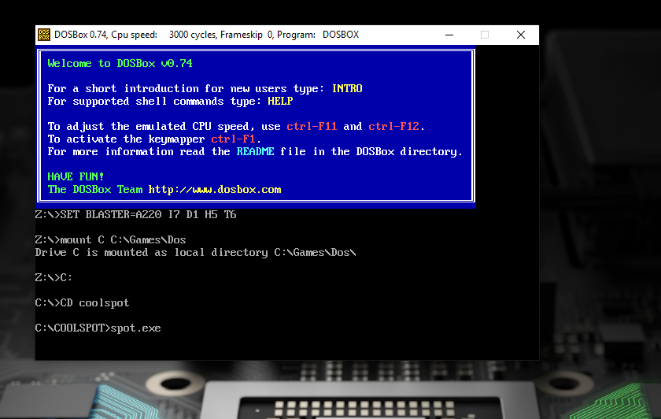
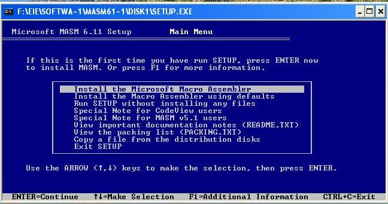

# Manual Tecnico

## Sobre los requisitos del software

Los requisitos para que funciones el programa o poder compilar su codig fuenre es neces los siguente:

[La instalacion de dosbox](https://www.dosbox.com/wiki/)

Programa necesario para poder instalar MASM en su version 611.

[Instalacion de MASM611 en dosbox](https://360techexplorer.com/install-masm-in-windows)

