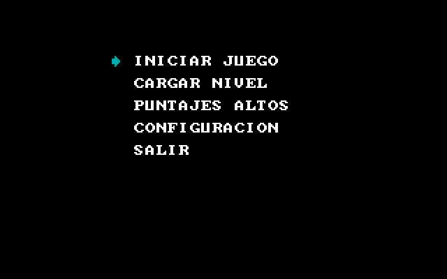
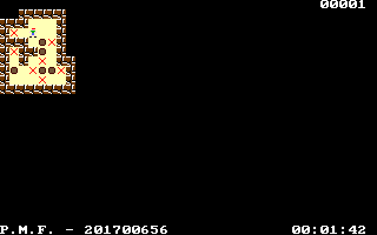
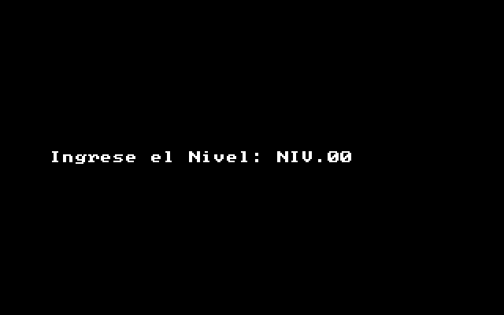

# Manual de Usuario

# Tabla de Contenido

- [Sobre el Software](#overview)
- [Inicio](#inicio-juego)
- [Menu Principal](#main-menu)
  - [Iniciar Juego](#init-game)
  - [Cargar Nivel](#upload-level)
  - [Herramientas](#tools-menu)
 
# Sobre el Software

El software es un juego, basado en Sokoban, usa las
mismas mecánicas que el juego antes mencionado.

#Inicio

El mensaje inicial aparace al momento de iniciar el programa!

# Menu Principal

En el menu principal se presentan la opciones para ingresar a sub menus que opciones que se describen continuacion.

# Iniciar Juego

En esta opcion inicia el juego y se carga desde el primer nivel.

# Cargar Nivel

En esta seccion se le pide que escriba el nombre de un nivel si existe se carga el nivel y si no existe se reiniciaria el juego.

<!-- # Menu Herramientas

En esa seccion se generan todos los reportes y se pueden ver en documentos de tipo el nombre del documento .HTM. -->
